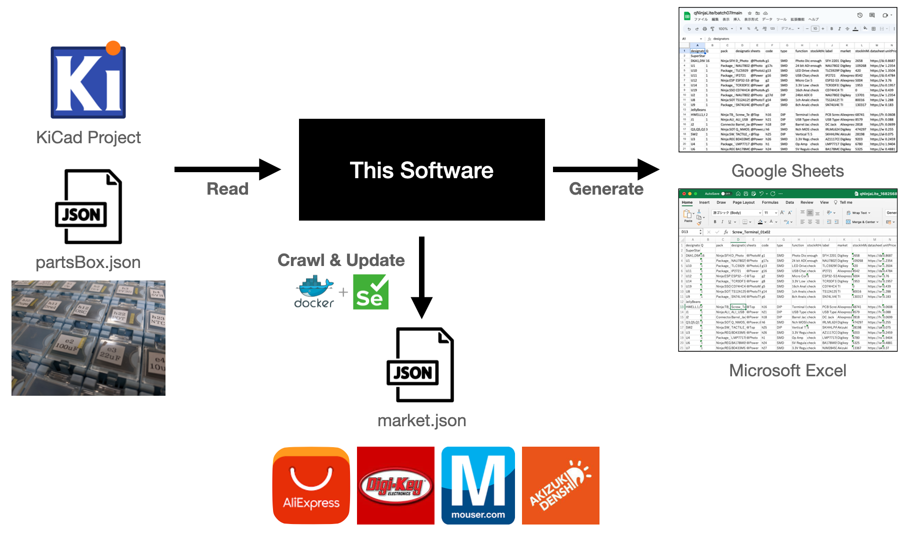

# KiCadToBom

Convert KiCad files into Google Sheets or Micrsoft Excel.
JSONs are not mandatory but your parts box label, latest market stock/price and total parts price of your board will be added if you prepare two. Mainly used for my personal purpose but notice me if you are interested.

